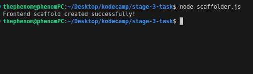
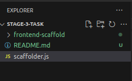
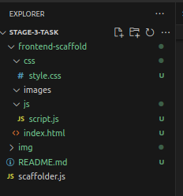

# Frontend Scaffolder
#### Generate scaffolds for frontend projects using NodeJS and JavaScript
---

#### Requirements
- JavaScript
- NodeJs

#### Installation
1. Clone the repository using `git clone`.
```
<!-- create a new folder named 'scaffold-generator'-->
mkdir scaffold-generator

<!-- move into the scaffold-generator folder -->
cd scaffold-generator

<!-- clone the git repository -->
git clone https://github.com/21stPhenom/kodecamp-stage-3.git
```
2. Create a `.gitignore` file and add `frontend-scaffold` to prevent git from tracking your `frontend-scaffold` upon creation.

#### Usage
1. Open your terminal and change directory to the folder that contains `scaffolder.js`.

2. Run the `scaffolder.js` file using `node`
```
node scaffolder.js
```
If the scaffold creation is successful, `Frontend scaffold created successfully` will be created.


The `frontend-scaffold` folder will be visible in your file explorer.


---
You can expand the folder and its subfolders to view the contents.



2. Make changes to the files or folder structure as it suits your needs.
>You can also copy the `frontend-scaffold` folder to a new location depending on your needs.

#### Contributing to this repository
Sorry, we are not accepting contributions at the moment.